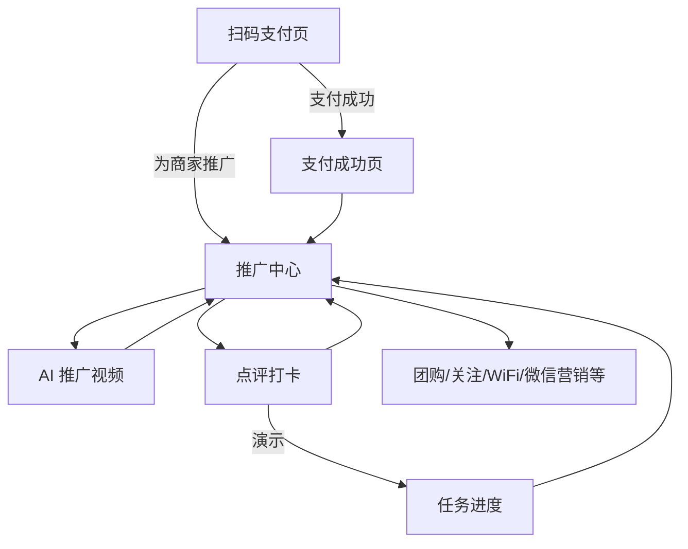
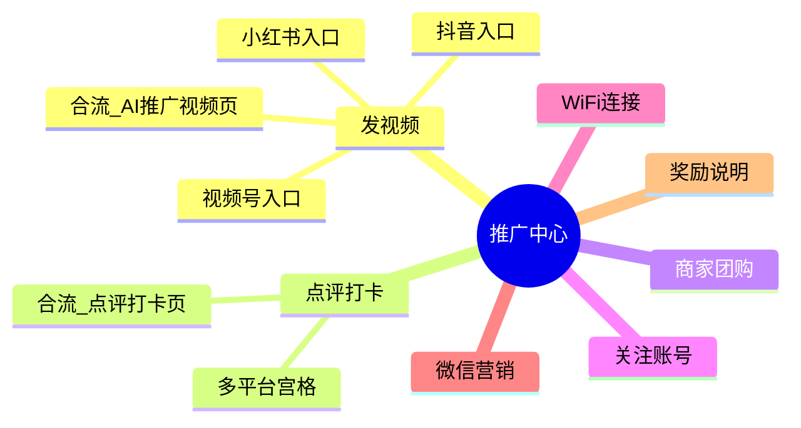
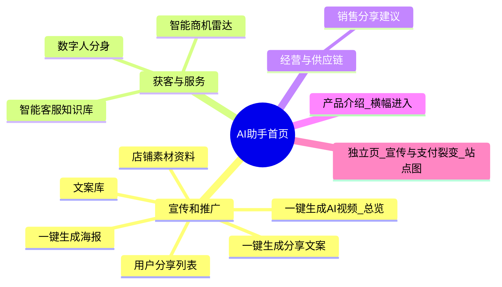
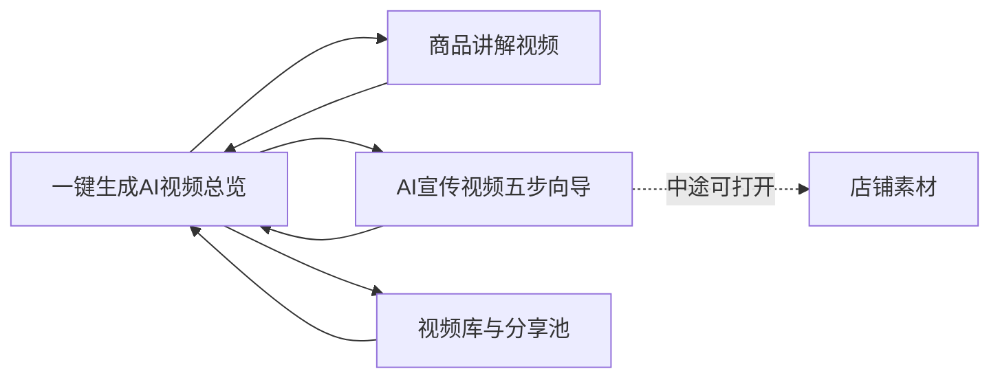
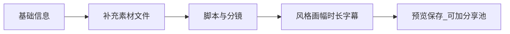
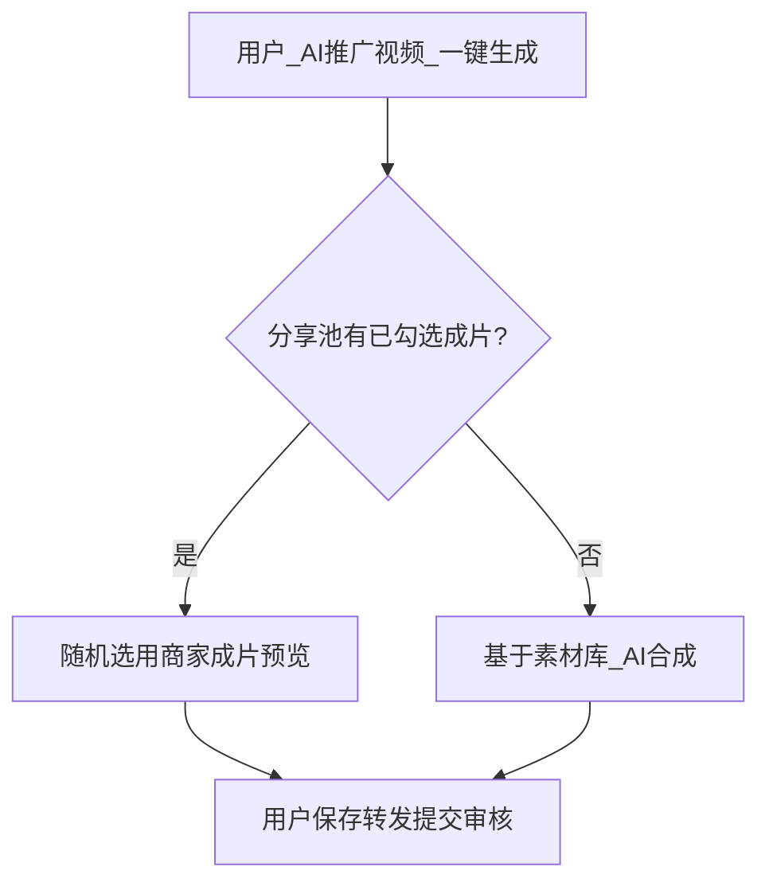
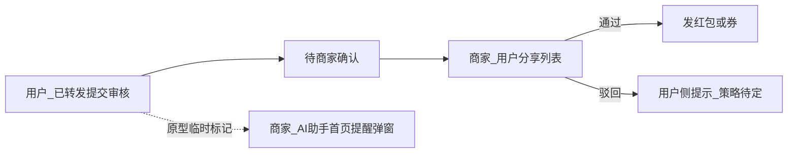
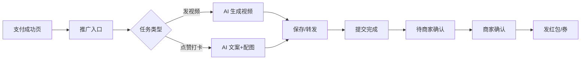

# 麟云开物支付平台 · AI 工具助手

**产品需求文档（PRD）**

> 与 `LYKW-AITools/prd.html`（格式化网页版，v0.3.1）内容对齐；日常协作可优先打开网页版对照交互原型 `LYKW-AITools/index.html`。

| 项目 | 说明 |
|------|------|
| 产品名称 | 麟云开物支付平台 — AI 工具助手 |
| 文档版本 | v0.3.1 |
| 更新日期 | 2026 年 3 月 31 日 |
| 终端形态 | 手机端（商家端 App / H5、用户端支付成功页及配套页面） |
| 文档状态 | 初稿，待评审 |

---

## 1. 背景与目标

### 1.1 背景

用户在麟云开物完成支付后，具备为商家**裂变传播、沉淀口碑**的动机；商家侧需要**低门槛产出宣传素材**并**可控地发放激励**（红包、优惠券等）。通过 AI 降低内容生产成本，通过支付场景自然触达用户，形成「支付成功 → 推广任务 → 商家确认 → 激励发放」闭环。

### 1.2 产品目标

- **用户侧**：支付成功页提供明确入口，一键生成可保存、可转发的推广视频与图文素材；参与点赞打卡等轻量任务；完成后有机会获得红包/优惠券等权益。
- **商家侧**：在「我的」中进入 AI 助手，维护店铺素材库，按参数生成宣传视频与文案，审核后可用于活动或对用户侧任务进行激励配置。
- **平台侧**：增强支付后黏性、提升商家活跃度与营销转化数据可追踪性（具体指标见第 9 节）。

### 1.3 范围说明

- **本期重点**：用户端支付成功后的推广链路、商家端 AI 助手入口及素材与生成能力、商家对用户推广行为的确认与激励发放。
- **暂不展开**（可单列二期）：与第三方短视频/社交平台深度 OAuth、复杂投放托管、数字人直播等。

---

## 2. 名词与角色

| 术语 | 定义 |
|------|------|
| 用户（C 端） | 在商家场景下完成支付的消费用户 |
| 商家（B 端） | 使用麟云开物收款的入驻商户 |
| 推广任务 | 发视频、点赞打卡等由平台/商家侧配置的用户可参与行为 |
| 素材库 | 商家在 AI 助手中维护的店铺介绍、图片、视频等，用于 AI 生成 |
| 商家确认 | 商家对用户完成的推广行为或待发放激励进行审核/确认的动作 |

---

## 3. 原型界面关系与主流程（业务描述）

本章用**序号分点**梳理跳转，并配 **Mermaid** 流程图 / 思维导图（与第 6 章相同，可在支持 Mermaid 的编辑器或文档站中渲染）。界面名称与交互原型一致，不含工程命名。

### 3.1 用户端：页面跳转（分点）

1. **扫码支付页**：确认金额、优惠后「支付」→ **支付成功页**；或点「为商家推广」→ 直接进入 **推广中心**（与支付成功后的宣传入口同一落地）。
2. **支付成功页**：展示订单结果；底部宣传卡片 → **推广中心**；文案提示规则以商家为准、奖励须商家确认。
3. **推广中心**：顶区价值说明 + 底区奖励摘要；中部宫格模块见下文「推广中心模块一览」思维导图。
4. **发视频模块**：抖音 / 小红书 / 视频号三个入口 → 同一 **AI 推广视频**页（渠道可区分埋点或话术）。返回 → 推广中心。
5. **点评打卡模块**：多平台宫格 → 同一 **点评打卡**页；生成文案与配图后可保存、复制、转发、提交审核；可演示进入 **任务进度**。返回 → 推广中心。
6. **团购 / 关注 / Wi‑Fi / 微信营销**：原型为轻提示演示；正式版接外链或小程序。
7. **AI 推广视频页**：待生成 → 生成中 → 结果；结果可保存、转发、「已转发，提交审核」→ 进入待商家确认；优先逻辑见 3.3。
8. **任务进度页**：展示到账红包、券等示意；从打卡页演示进入；返回 → 推广中心。

**图 3-1　用户端主链路（流程图）**

**图 3-2　推广中心模块分流（思维导图 / mindmap，需 Mermaid 9.2+ 渲染）**

### 3.2 商家端：页面跳转（分点）

1. **我的**：营收与功能宫格 → 点「AI 工具」→ **AI 助手**首页；返回键 → 我的。
2. **AI 助手首页**：顶部额度卡 + 横幅（可进 **产品介绍**长页：能力、资费、开通）；主体三大分组见下图「思维导图」。
3. **一键生成 AI 视频（总览）**：三条支线见「图 3-4」——商品讲解视频、AI 宣传视频五步向导、视频库 · 分享池；各支线结束返回总览；向导内可跳转 **店铺素材**。
4. **一键生成分享文案**：选场景 / 风格 / 篇幅 → 生成正文与配图 → 可存 **文案库**；文案库可由本页入口进入，上一页为分享文案页。
5. **一键生成海报**：填主题与版式 → 预览 → 保存「我的海报」或分享（示意）。
6. **店铺素材资料**：独立编辑页，从 AI 助手或视频向导跳转；保存后返回来源页。
7. **用户分享列表**：待办列表，通过 / 驳回 / 发红包券；用户提交审核后，原型在下次进入 AI 助手首页时 **推广提醒弹窗** → 可「查看」直达本列表；另有静态「弹框展示」页仅供视觉评审。
8. **智能商机雷达**：线索列表 → 查看资讯 / 自主回复 / 智能回复（演示）。
9. **智能客服**：四页签——会话接待、知识库、资料政策、参数；顺序与能力见分点 ⑩。
10. **智能客服（能力顺序）**：① 自定义问答命中 → ② 资料关键词 → ③ 兜底话术；支持人工回复、会话入库草稿。
11. **数字人分身**：人设 / 音色 / 场景 / 商品绑定 → **配置摘要** → 生成预览（演示队列）。
12. **销售分享建议**：指标与表格 → 配货建议 → 提销量手段；可跳转海报、分享文案。
13. **商家宣传与支付裂变**：独立演示页（站点图直达），可跳转用户侧扫码支付、支付成功、推广中心串联闭环。

**图 3-3　AI 助手首页信息架构（思维导图，需 Mermaid 9.2+ 渲染）**

**图 3-4a　「一键生成 AI 视频」总览与子页回路（流程图）**

**图 3-4b　AI 宣传视频 · 五步向导顺序（流程图）**

### 3.3 跨端协同（分点 + 流程图）

1. **视频成片来源**：用户「一键生成」时，若商家在 **视频库 · 分享池** 已勾选可用成片，则 **随机选一条** 作为预览结果；否则走基于 **店铺素材** 的合成策略。
2. **素材质量**：店铺素材越完整，用户侧成片与打卡文案成功率越高。
3. **文案 / 海报**：商家侧文案库、海报与用户打卡页 **不必一一绑定**；是否预置模板供用户一键选用待评审。
4. **提交与提醒**：原型用浏览器临时标记模拟「用户已提交 → 商家进首页弹窗」；正式版由 **订单 + 任务状态** 驱动消息或弹窗。

**图 3-5　跨端：视频生成优先策略（流程图）**

**图 3-6　跨端：推广任务闭环（流程图）**

---

## 4. 用户端需求（手机端）

### 4.1 入口与身份

支付成功页须有醒目**宣传入口**（文案与奖励可配置）；扫码付款页可提供**同一套**「为商家推广」入口以保证动线一致。未登录或会话异常时，须引导登录或与订单身份绑定，防止冒领。各推广模块与按钮须支持按商家/活动**配置显隐与排序**。

### 4.2 推广中心

聚合展示价值主张、分模块能力宫格与页底奖励说明；对依赖外链或系统能力的操作须有明确反馈（如轻提示），避免用户认为无响应。团购、关注、Wi‑Fi、微信营销等须遵守各平台与合规要求（深链、授权、防骚扰）。

### 4.3 AI 推广视频

基于当前订单与商家素材生成短视频；展示排队或进度；失败时原因可解释且可重试。结果支持预览、保存与系统分享。须限制单订单重复生成次数以控制成本。用户声明「已转发」或提交凭证的规则与产品、合规共同敲定。

### 4.4 点评打卡（文案 + 配图）

一键生成适配社交与点评场景的文案与配图；支持风格切换、保存图片、复制文案与分享。完成后任务进入待商家确认状态。

### 4.5 完成与激励

任务提交后进入「待商家确认」；商家通过后发放红包或优惠券，并向用户展示到账与使用说明。若驳回或超时，须有明确用户提示及后续申诉或客服路径（策略待定）。

---

## 5. 商家端需求（手机端）

### 5.1 入口与权限

从**我的**进入 **AI 助手**；仅主账号或具备营销/AI 助手子权限的店员可见，权限与现有商家后台角色模型对齐。

### 5.2 店铺素材与资料

维护店铺介绍文本，上传门面/菜品/环境等图片并可设封面，可选上传参考短视频；保存前进行版权与肖像权等合规确认。关键字段缺失时，宜在用户生成前提示商家补全。

### 5.3 一键生成 AI 视频（总览能力）

**商品讲解视频**：支持从商品链接或店内编码拉取信息，确认解说稿后生成竖版讲解片，可下载或上架详情。**AI 宣传视频**：分步补充门店与单品信息、可选上传补充文件、生成可编辑脚本、选择风格与画幅及字幕等参数后渲染；预览不满意可按文字说明重生成；成片可入库并可选加入用户侧随机分享池。**视频库 · 分享池**：维护已保存列表并控制哪些参与用户端随机选用。

### 5.4 分享文案与文案库

按场景、风格、篇幅生成正文与配展示意图；支持落库与在文案库中按时间浏览、复制与放大查看配图（正式版图需审核与版权控制）。

### 5.5 一键生成海报

按场景与版式生成可转发或可打印的海报预览；支持保存至商家侧海报列表与分享（正式版对接微信、相册等系统能力）。

### 5.6 用户分享列表与激励

列表展示关联订单、任务类型、时间与凭证（若有）；支持通过、驳回、发红包/发券；后续可扩展批量与筛选与平台风控策略对齐。

### 5.7 智能商机雷达

聚合公开渠道线索，支持浏览原文、人工跟进与 AI 辅助回复草稿（须符合平台私信与反垃圾规则）。

### 5.8 智能客服与知识库

多会话接待、自动与人工协同；可维护问答对、长文档资料与机器人参数；转人工关键词与未命中时的兜底策略可配置。正式环境应对接持久化、向量检索与质检。

### 5.9 数字人分身

将人设、音色、场景与商品绑定，生成可供短视频或直播辅助使用的数字人预览；配置项需可汇总展示以便与后端渲染参数一致。

### 5.10 销售分享建议

展示销量、销售额、库存与库销比等经营数据（与中台/订单对齐），输出补货与配货建议，并链接到内容、套餐、会员与渠道等提销量动作。

### 5.11 产品介绍与裂变说明页

产品介绍页承担售卖与资费说明；「商家宣传与支付裂变」页承担对内培训/演示，说明支付后用户动线与商家确认发奖的闭环，不与 AI 助手首页争抢主入口时仍应可从运营入口访问。

> **演示与正式版差异：** 原型中部分数据保存在浏览器本地、配图与海报为示意样式、智能客服检索为规则演示；正式版须使用服务端存储、真实生图与向量检索、分享与审核组件，并与订单及任务状态机打通。

---

## 6. 核心业务流程（简述）

### 6.1 用户发视频 / 打卡

流程图（Mermaid）：

### 6.2 商家维护与生成

商家在 AI 助手中维护素材 → 配置视频参数并生成 → 商家确认成片 →（可选）进入用户侧可用素材池；并行处理用户推广待办列表并完成发奖。

---

## 7. 非功能需求

| 类别 | 要求 |
|------|------|
| 性能 | 视频生成异步化；列表页分页；关键操作有明确等待反馈 |
| 可用性 | 手机端单手操作友好；步骤不超过用户心理预期（一键优先） |
| 安全 | 商家与用户数据隔离；生成内容审计日志；激励发放与支付风控联动 |
| 合规 | 营销活动规则公示；不得以虚假进度诱导分享；红包/券需符合金融监管与平台规则 |
| 兼容 | iOS / Android 主流版本；分享、存相册权限按需申请 |

---

## 8. 依赖与接口（待技术评估）

- 支付成功页组件化配置能力（宣传框开关、文案、跳转参数）。
- AI 视频/图文生成服务（自建或三方）、存储与 CDN。
- 红包与优惠券发放能力、营销预算与商户账户。
- 消息通知（用户侧到账提醒、商家侧新待办提醒）。

---

## 9. 成功指标（建议）

| 指标 | 说明 |
|------|------|
| 支付成功页推广入口点击率 | 衡量触达效果 |
| 任务启动率、完成率 | 发视频 / 打卡分别统计 |
| 商家确认时效、发奖成功率 | 运营与体验 |
| 商家 AI 助手周活跃、素材完整度 | B 端采纳 |
| 投诉与风控拦截率 | 合规与健康度 |

---

## 10. MVP 与二期划分（建议）

| 阶段 | 内容 |
|------|------|
| **MVP** | 支付成功宣传框 + 推广入口；发视频与点赞打卡两任务；C 端生成、保存、系统分享；商家素材库（文图）；商家侧视频生成+参数（风格、时长、画幅）；待办确认+一键发红包/券 |
| **二期** | 更多任务类型；商家预置模板库；分享归因与深度平台对接；批量审核；更细风控与 A/B 文案 |

---

## 11. 待决策项（Open Questions）

1. 用户「转发成功」的判定标准：仅用户自述、系统分享回调、还是必须回传链接（各端能力不同）。
2. 红包/优惠券成本由平台补贴、商户承担还是按比例分摊。
3. AI 生成次数/时长套餐：是否纳入商户套餐或单独计费。
4. 商家采纳的视频是否强制作为 C 端唯一素材源，还是 C 端始终实时拼装素材库。

---

## 12. 文档修订记录

| 版本 | 日期 | 作者 | 说明 |
|------|------|------|------|
| v0.1 | 2026-03-30 | — | 初稿，基于业务口头需求整理 |
| v0.2 | 2026-03-31 | — | 扩充推广中心模块、子页衔接、扫码入口；补充用户与商家能力协同、AI 助手首页分组迭代、迭代要点与速查表；独立迭代清单并入商家章节；新增功能变化日志。 |
| v0.3 | 2026-03-31 | — | 按交互原型通盘梳理：新增第 3 章业务化「界面关系与主流程」；用户端与商家端需求改为分节叙述；移除工程标识与存储键；原第 5～12 章顺延为第 6～13 章；同步更新功能变化日志表述。 |
| v0.3.1 | 2026-03-31 | — | 第 3 章改为序号分点叙述，并增加 Mermaid 流程图与思维导图（用户主链路、推广中心分流、AI 助手架构、视频总览与子向导、跨端策略与闭环）；本 Markdown 与 `prd.html` 对齐。 |

---

## 13. 功能变化日志

记录相对前一文档版本在原型与 PRD 中的可见功能变化，便于评审与发版说明；实现细节以代码与接口为准。

| 日期 | 端 | 模块 | 变更摘要 |
|------|----|------|----------|
| 2026-03-31 | 文档 | 第 3 章 | v0.3.1：分点序号 + Mermaid 流程图 / mindmap（图 3-1～3-6） |
| 2026-03-31 | 文档 | PRD 全文 | v0.3 重构：界面跳转专章、需求叙述体、去代码命名；章节顺延 |
| 2026-03-31 | 商家 | AI 助手首页 | 「内容与商品」→「宣传和推广」；视频合并为「一键生成 AI 视频」Hub；新增分享文案、海报、文案库与用户分享列表归组；隐藏首页「商家宣传与支付裂变」主入口（页面保留） |
| 2026-03-31 | 商家 | 一键生成分享文案 | 场景/风格/篇幅；配图三列缩略图与灯箱；文案库朋友圈式列表；浏览器本地演示数据 |
| 2026-03-31 | 商家 | 一键生成海报 | 配置项与渐变预览演示；保存至海报库、轻提示演示分享 |
| 2026-03-31 | 商家 | 智能客服 | 多 Tab（会话、知识库、资料政策、参数）；人工回复与问答入库草稿；关键词检索演示 |
| 2026-03-31 | 商家 | 数字人 | 性别、年龄段、性格等配置扩展；配置摘要 |
| 2026-03-31 | 商家 | 销售分享建议 | 原智能备货建议升级为经营视图；销量/库存看板、配货建议、提销量手段与跳转海报/文案 |
| 2026-03-31 | 用户 | 发视频 | 一键生成优先随机选用商家分享池成片，否则回退 AI 合成（与 B 端分享池联动） |
| 2026-03-31 | 用户/商家 | 闭环演示 | 用户提交审核后由浏览器临时会话标记触发商家端提醒（仅原型） |

---

*本文档用于产品内部分析与研发评估，具体 UI 稿与接口字段以设计稿与 API 文档为准。交互原型与 HTML 版 PRD 见目录 `LYKW-AITools/`。*
