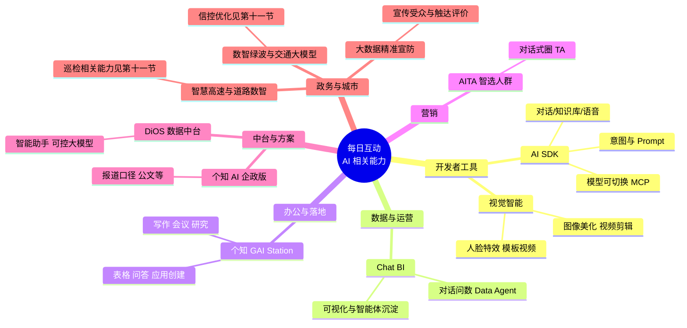
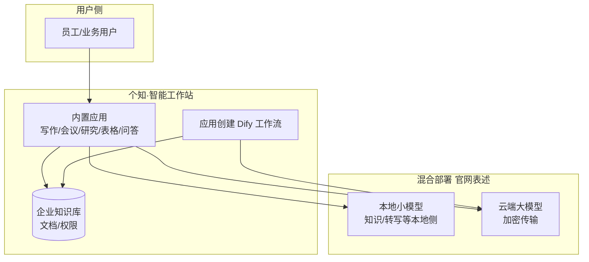
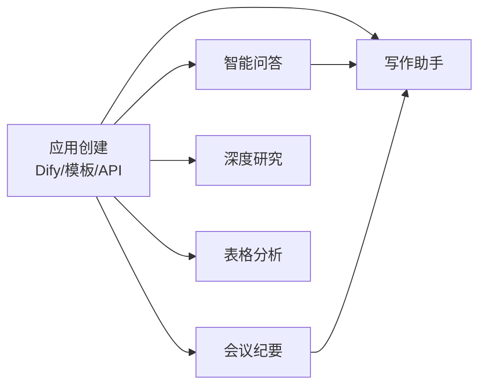

# 每日互动（个推）AI 产品梳理

**版本**：V1.7  
**整理日期**：2026-03-18（V1.7 删除第一节 1.1「如何查看脑图」）  
**说明**：依据每日互动官网（`ge.cn` / `getui.com`）及公开报道整理；非官网条目已标注「公开报道」。

---

## 一、可视化：脑图与架构图（Mermaid）

### 1.1 产品全景脑图（按业务层级）

### 1.2 个知·智能工作站：部署与数据流（示意）

### 1.3 个知·智能工作站：六大应用关系（示意）

---

## 二、开发者侧：AI SDK

**官网**：[https://www.getui.com/ai-sdk](https://www.getui.com/ai-sdk)  

**定位**：面向 App 的开箱即用 AI 能力集成，快速上线对话式能力。

| 能力方向           | 说明（官网表述）                           |
| -------------- | ---------------------------------- |
| **对话模式**       | 极速/深度思考切换、联网搜索、知识库问答、语音输入          |
| **意图与 Prompt** | 基于 App 特色的意图识别、Prompt 配置，定制回答风格与侧重 |
| **知识库问答**      | 学习 App 内产品/服务/内容，做业务语境下的专业问答       |
| **个性化性格**      | 性格体系、按用户偏好调整回答方式                   |
| **扩展与模型**      | 切换底层模型、对接 MCP、搜索引擎等                |
| **接入方式**       | 提供完整对话页面，低开发量集成                    |

**典型场景（官网）**：影音、资讯、旅游、电商等（影评/摘要/攻略/导购等）。

---

## 三、运营与数据：Chat BI

**官网**：[https://www.getui.com/chat-bi](https://www.getui.com/chat-bi)  

**定位**：企业级对话式 Data Agent / 智慧问数。

| 能力         | 说明                            |
| ---------- | ----------------------------- |
| **意图与联想**  | 理解模糊业务问题，关联企业知识库，口语转多个精准查询供选择 |
| **多轮对话**   | 连续追问、上下文记忆、深度下钻               |
| **业务知识维护** | 自定义术语、指标口径，实时生效               |
| **过程透明**   | 关键分析步骤展示，可人工调整，降低黑盒与幻觉风险      |
| **可视化**    | 秒级出图，匹配分析场景                   |
| **沉淀智能体**  | 问数指标、图表可保存，形成专属数据专家           |

**场景**：管理层决策、一线复盘、数据团队沉淀分析体系等。

---

## 四、视觉与多媒体：个推视觉智能

**官网**：[https://www.getui.com/vision-intelligence](https://www.getui.com/vision-intelligence)  

**定位**：以图像/音视频为载体的智能视觉 SDK/API（偏 CV）。

| 模块        | 功能要点                                       |
| --------- | ------------------------------------------ |
| **图像**    | AI 美肤、美妆、滤镜及多项拍照/美化能力，多主题 UI               |
| **视频**    | 录制与剪辑：美颜、美妆、滤镜、画中画、拼接、分割、裁剪等               |
| **人脸 AI** | 自研人脸检测与 106 关键点，智能美颜、动态贴纸、高级美妆             |
| **模板视频**  | AE 模板在移动端还原，替换素材一键成片                       |
| **形态**    | 图像 SDK、视频剪辑 SDK、特效相机（流处理）、模板视频 SDK 及各类 API |
| **平台**    | iOS、Android、Server（Linux/Windows）、PC 等     |

---

## 五、办公与行业落地：个知·智能工作站 GAI Station

**官网**：[https://www.getui.com/gaistation](https://www.getui.com/gaistation)  

### 5.1 产品定位与形态（官网归纳）

- **定位**：软硬一体、**混合部署**的一站式「专业级 AI 办公/业务」落地形态；强调 **本地小模型 + 云端大模型**、知识/文件可本地侧处理、大模型侧加密传输等**安全可信**叙事。
- **价值主张**：「让 AI 用得起、更用得起来」——偏 **开箱应用 + 企业知识库 + 低代码扩展**（内置 Dify），而非仅提供一个聊天窗口。
- **版本**：**在线版**（随开随用）、**个人版**（轻量个人助理）、**单位版**（百人级团队 / 企业、偏 AI PC 与组织落地）。

### 5.2 能力模块一览（官网）

| 应用 | 功能要点 |
| ---- | -------- |
| **写作助手** | 文风管理、以稿写稿、出处溯源、文稿模板、四级语料库、引导式/语音创作等 |
| **会议纪要** | 实时/录音转写、多人与声纹、联动写作助手出纪要、本地转译强调私密性等 |
| **深度研究** | 企业知识库联动、预置专业智库、多轮搜索、计划-搜索-推理-总结、结构化报告 |
| **表格分析** | 自然语言指令、Multi-Agent、多文件多 Sheet、生成 SQL、预测建模等 |
| **智能问答** | 角色与权限、定向问答、大文档量与多格式/多模态解析（官网量级描述） |
| **应用创建** | 低代码/零代码、内置 **Dify** 搭工作流、行业模板、API/插件等 |

**官网还强调**：多源数据打通与权限管理；快速部署上线类表述；政企/制造/医疗/科研等案例背书。

### 5.3 优势分析（结合官网卖点 + 常见落地逻辑）

| 维度 | 说明 |
| ---- | ---- |
| **场景覆盖全** | 写作、会议、研究、表格、问答、自建应用一条龙，减少「买多个单点工具」的集成成本。 |
| **企业知识闭环** | RAG + 权限 + 多格式文档，适合「制度/标书/公文/内部知识」类高频办公。 |
| **安全与合规叙事强** | 混合部署、本地转写/本地知识存储等表述，对政务、金融、医疗等**数据不能全上公网**的客户更友好。 |
| **可扩展性** | 内置 Dify、API、插件与模板，业务侧可在一定程度上**自建工作流**，不过度依赖原厂每次定制。 |
| **与个推数据智能体系协同** | 若已使用每日互动数据中台、营销/用户类能力，可在方案层面做**数据与 AI 应用**联动（具体以商务方案为准）。 |

### 5.4 劣势与风险（客观项，建议 PoC 验证）

| 维度 | 说明 |
| ---- | ---- |
| **厂商与栈锁定** | 软硬一体 + 内置 Dify 等组合，长期存在**升级路径、版本兼容、替换成本**问题，需在合同中明确模型与组件边界。 |
| **「本地+云端」复杂度** | 网络策略、证书、审计、灾备、并发与算力规划比纯 SaaS 更重，**IT 运维与信息安全**需全程参与。 |
| **效果依赖知识治理** | RAG 质量强依赖文档质量、切分策略、更新机制；**垃圾进垃圾出**，需配套知识运营而非「装完即用」。 |
| **大模型共性风险** | 写作/研究/表格结论仍可能出现**幻觉或错误推理**；表格分析与 SQL 生成需重点做**权限与数据脱敏**评审。 |
| **成本与规模** | 单位版/私有化往往涉及**license、算力、实施与培训**；百人以上需评估并发与存储（官网案例为宣传口径，以报价为准）。 |
| **与现有 OA/IM 打通** | 若要求深度嵌入钉钉/企微/飞书或现有 OA，需单独确认**集成深度、单点登录、留痕审计**，避免「又一个独立入口」。 |

### 5.5 适用场景 vs 不太适合

**更适合**：

- 政府机关、国企、医院、律所/事务所等对**数据驻留、审计、权限**要求高的知识密集型办公；
- 已有大量 Word/PDF/表格等**非结构化知识**需统一检索与问答；
- 希望**一套产品**覆盖纪要、写作、研报、表格问数，并允许业务侧轻量搭流程。

**需慎重或对比选型**：

- 仅需「全员 ChatGPT 类网页」、无知识库与流程诉求——可能**过重、性价比不优**；
- 核心需求是 **BI/数仓深度治理** 而非办公 Copilot——可对比 **Chat BI + 数据中台** 或专用 BI 产品；
- 强依赖**完全离线、无外网**环境——需确认云端大模型调用是否允许及离线能力边界。

### 5.6 选型 / PoC 建议（简表）

| 验证项 | 关注点 |
| ------ | ------ |
| 知识库 | 上传典型文档后的召回率、多轮问答准确率、更新时效 |
| 权限 | 部门/项目级隔离、导出与水印、审计日志是否满足内控 |
| 会议与写作 | 真实会议录音转写准确率、公文/合同类是否需人工复核流程 |
| 表格分析 | 复杂表、跨 Sheet、敏感字段下的 SQL 与结果可信度 |
| 部署与 SLA | 本地/混合架构、故障恢复、版本升级与数据迁移方案 |

---

## 六、营销侧：AITA 智选人群（公开报道）

**定位**：品牌营销场景的大模型 + 数据能力，AI-Targeting Audience。

| 要点           | 说明                            |
| ------------ | ----------------------------- |
| **对话式圈人**    | 用自然语言描述需求，生成投放/营销用目标人群        |
| **无种子洞察**    | 报道中强调可在缺少种子用户时仍做人群分析与定向       |
| **技术逻辑（报道）** | LLM 理解需求 + 数据编织，将语言描述映射为标签/特征 |

> 以大会发布与媒体报道为主，具体功能边界与是否独立售卖以商务/最新材料为准。

**参考**：个推学院相关文章，如「AITA智选人群工具：用大模型定向投放人群」等。

---

## 七、数据中台与可控大模型：DiOS / DiOS 智能助手（公开报道）

**定位**：数据智能操作系统 DiOS；报道中称将大模型融入 DiOS，推出 DiOS 智能助手（私有化开源大模型 + 行业元数据/治数经验）。

| 能力方向（报道归纳）  | 说明                                   |
| ----------- | ------------------------------------ |
| **自然语言用数**  | 用对话完成分析思路、代码/策略辅助、人群圈选等描述性任务         |
| **数据治理与应用** | 强调把治数、用数经验输入模型，面向治理、加工、应用            |
| **安全与可控**   | 「可控大模型」：算力/算法/算料；联合计算、「数据不流转价值流转」等表述 |

另有 GAI OS 等升级叙事（媒体报道），与 DiOS 演进相关；具体产品命名与对外售卖形态以财报/官网解决方案页为准。

**解决方案入口（官网）**：[https://www.getui.com/dios](https://www.getui.com/dios)  

---

## 八、个知 AI（企业版 / 政务版）（公开报道）

报道中的「个知 AI」常与可信数据空间、可控大模型、DeepSeek/Qwen 等模型融合一并出现：

- **企业版**：对话调取模板、专家经验、业务数据，缓解信息孤岛（报道口径）。
- **政务版**：公文写作助理等，强调风格、大纲、全文生成及与政务 OA 对接（报道口径）。

与 GAI Station（个知智能工作站）在品牌上同属「个知」体系；实际采购时需区分纯软件工作站与行业/政务方案的组合报价。

---

## 九、汇总表

| 产品/系列                    | 官网明确 AI 营销 | 类型简述                         |
| ------------------------ | ---------- | ---------------------------- |
| **AI SDK**               | ✅          | App 内对话、知识库、语音、模型可换          |
| **Chat BI**              | ✅          | 对话式数据分析 Agent                |
| **视觉智能**                 | ✅（智能视觉/CV） | 美颜、剪辑、人脸、模板视频等               |
| **个知·智能工作站 GAI Station** | ✅          | 办公套件 + RAG + 表格/研究/纪要 + Dify |
| **AITA 智选人群**            | 主要见报道      | 对话式营销人群生成                    |
| **DiOS 智能助手**            | 主要见报道      | 数据中台 + 大模型对话用数/治理            |
| **个知 AI（企/政）**           | 主要见报道      | 可控大模型、公文等垂直场景                |
| **智慧高速 / 道路数智（含巡检相关能力）** | 个推学院/解决方案 | 数据中台 + 图像智能 + 行业算法、「数据大脑」 |
| **数智绿波 / 数智交通大模型**       | 个推学院 + 财经报道 | 信控与绿波优化、五步法闭环、AI Agent 等表述  |
| **大数据精准宣防**             | ✅ 官网产品页    | 受众筛选、社媒触达、宣传效果量化            |

---

## 十、参考链接

| 类型        | URL                                                                                    |
| --------- | -------------------------------------------------------------------------------------- |
| 公司/产品总览   | [https://www.ge.cn/product](https://www.ge.cn/product)                                 |
| AI SDK    | [https://www.getui.com/ai-sdk](https://www.getui.com/ai-sdk)                           |
| Chat BI   | [https://www.getui.com/chat-bi](https://www.getui.com/chat-bi)                         |
| 视觉智能      | [https://www.getui.com/vision-intelligence](https://www.getui.com/vision-intelligence) |
| 个知·智能工作站  | [https://www.getui.com/gaistation](https://www.getui.com/gaistation)                   |
| 数据中台 DiOS | [https://www.getui.com/dios](https://www.getui.com/dios)                               |
| 城市治理      | [https://www.getui.com/smart-city](https://www.getui.com/smart-city)                   |
| 大数据精准宣防   | [https://www.getui.com/publicity-prevention-platform](https://www.getui.com/publicity-prevention-platform) |
| 智慧高速方案（个推学院） | [https://www.getui.com/college/2022011856](https://www.getui.com/college/2022011856)   |
| 数博会-数智交通等（个推学院） | [https://www.getui.com/college/2024090220](https://www.getui.com/college/2024090220)   |

---

## 十一、场景补充：AI 道路智能巡检、AI 信控优化与大数据精准宣防

> 下列三项对应您关心的 **2 / 3 / 4** 号线索；其中第 2、3 项在公开材料中与「智慧高速」「数智绿波」「数智交通大模型」等名称交织，文中已做**官方表述与常见叫法**的对照。

### 11.1 AI 道路智能巡检（智慧高速 / 数据中台 + 图像智能）

**官网与个推学院主线**：每日互动将交通/高速场景落在 **数据中台「每日治数平台」（DiOS）** 与 **智慧高速解决方案** 中，强调多源数据融合与行业算法，而非单独一条名称为「AI 道路智能巡检」的产品线。

| 要点 | 内容（来源：个推学院《智慧高速解决方案》等） |
| ---- | ---------------------------------------- |
| **数据侧** | 汇聚导航、ETC、服务区卡口、路网摄像头、车载终端、IoT 等多源异构数据，治理后统一服务业务。 |
| **能力侧** | 综合运用 **算法建模、机器学习、图像智能** 等；沉淀高速/交通特色算法与模板，构建高速「**数据大脑**」。 |
| **应用侧（举例）** | 全局态势感知、匝道等路段 **预判预警**、拥堵疏导与应急救援支撑、服务区车流预测与 **智慧控流** 等。 |
| **合作披露** | 与浙江高信等单位在投建管养数据、疏堵救援、智慧服务区等方面合作（学院文章表述）。 |

**与「巡检」的对应说明**：官网文章侧重 **路况感知、预测、服务区控流** 等；社会报道中有「用 AI 给道路做体检、巡检里程」等提法（如腾讯新闻等，**属公开报道**），与官网「图像智能 + 高速数据应用」能力方向一致，但**具体产品名、是否单独立项**需以商务材料为准。

**延伸阅读**：个推学院 [智慧高速解决方案](https://www.getui.com/college/2022011856)。

---

### 11.2 AI 信控优化与「智能体」（数智绿波 × 数智交通大模型）

**名称对照**：公开材料中更多出现 **「数智绿波」产品**、**「数智交通大模型」**（与生态公司联合）；您所说的 **「AI 信控优化智能体」** 可理解为：**以数据 + 算法 + 大模型/Agent 能力，支撑信号配时与绿波协同优化** 的一类能力组合，而非官网单独列名的唯一产品词条。

**个推学院（2024 数博会稿）要点**：

- **数智绿波**：多方数据融合 + 智能算法建模，在**用好现有硬件**前提下快速形成城市道路 **绿波配置方案**。
- **落地**：杭州深度应用并助力 **国内首个全域绿波城市**；浙江、安徽、江苏、山西等 **15 个省市**落地，**平均道路提速超 20%**（学院文章数据，以最新官方为准）。

**财经媒体报道（新浪财经等，2024-04）对「数智交通大模型」的补充表述**：

- 在不依赖大量新增硬件感知的前提下，构建 **千亿级交通数据集**。
- 技术要素：**Transformer、NL2Script、SUMO 仿真、AI Agent** 等。
- 闭环：**数据感知 → 方案生成 → 仿真预测 → 下发执行 → 效果监测**（「五步法」）。
- 目标表述：助力 **全域绿波覆盖**，改善市民出行体验（「三红一绿」→「三绿一红」等传播口径）。

**延伸阅读**：个推学院 [2024 数博会相关稿（数智绿波与落地数据）](https://www.getui.com/college/2024090220)；城市治理方案见 [城市治理](https://www.getui.com/smart-city)。

---

### 11.3 大数据精准宣防

**官网**：[https://www.getui.com/publicity-prevention-platform](https://www.getui.com/publicity-prevention-platform)

**定位**：面向 **政府宣传工作**，用互联网大数据 **筛选宣传受众**，结合 **社交媒体** 等平台 **精准触达**，并对成效做 **量化监测、分析与评估**，目标为 **精准、减负、降本、增效**（官网首屏表述）。

**应用场景（官网列举）**：反诈、文旅、**交通安全**、平安教育、普法、消防、政策传达等。

**产品优势（官网归纳为四类）**：

| 维度 | 要点 |
| ---- | ---- |
| **精准人群** | 精准定向受众、海量特征数据、丰富多维标签 |
| **精准素材** | 形式多样、匹配宣传素材、结合人群标签 |
| **精准触达** | 智能滴灌、全网触达、定时定量投放 |
| **精准评价** | 投放效率、数据可追踪、宣传可量化 |

**服务案例（官网摘要）**：如浙江某乡镇反诈宣传（稿件中给出案件/金额下降比例等，**以官网最新案例为准**）、杭州某街道反诈、县级市交通安全教育、嘉兴平安三率、余杭文旅定向宣传等。

---

## 十二、备注

1. 「用户运营、消息推送、人口数盘、营销数盘」等以数据与运营为主，官网未归入「AI 提效」的，本文未单独列为 AI 产品线。
2. AITA、DiOS 助手、个知 AI 企政版细节以个推商务、最新发布会或财报披露为准。
3. **第五节「个知·智能工作站」** 中优势/劣势与选型为**调研归纳**，非厂商承诺；采购与验收以合同与 PoC 实测为准。
4. **第一节 Mermaid 图** 为示意结构，与厂商内部架构不一定一致。
5. 本文件仅供内部调研参考。

